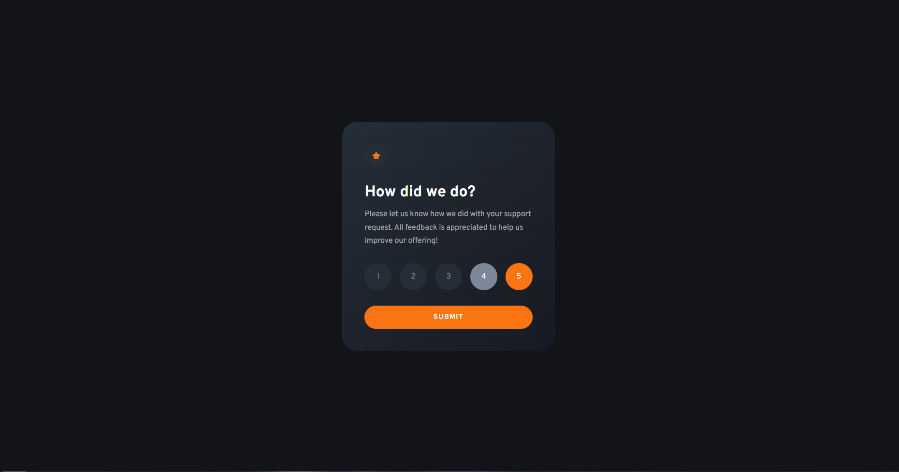
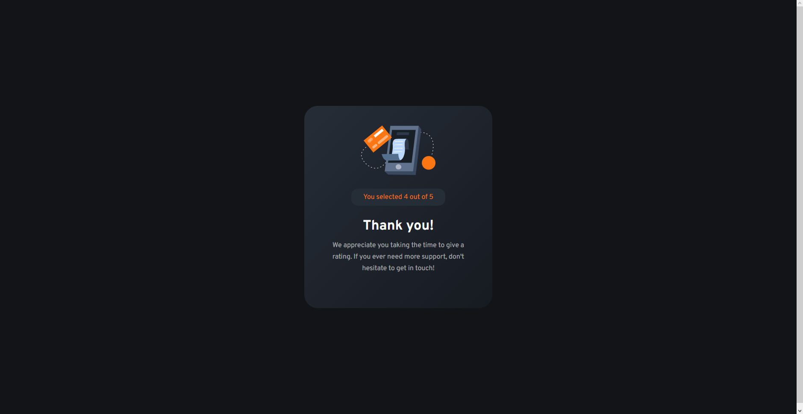

# Frontend Mentor - Interactive rating component solution

This is a solution to the [Interactive rating component challenge on Frontend Mentor](https://www.frontendmentor.io/challenges/interactive-rating-component-koxpeBUmI). Frontend Mentor challenges help you improve your coding skills by building realistic projects.

## Table of contents

- [Overview](#overview)
  - [The challenge](#the-challenge)
  - [Screenshot](#screenshot)
  - [Links](#links)
- [My process](#my-process)
  - [Built with](#built-with)
  - [Continued development](#continued-development)
  - [Useful resources](#useful-resources)
- [Author](#author)

## Overview

### The challenge

Users should be able to:

- View the optimal layout for the app depending on their device's screen size
- See hover states for all interactive elements on the page
- Select and submit a number rating
- See the "Thank you" card state after submitting a rating

### Screenshot

### Links

- Solution URL: [https://deft-entremet-c7add0.netlify.app](https://deft-entremet-c7add0.netlify.app)

## My process

### Built with

- Semantic HTML5 markup
- CSS custom properties
- Flexbox
- CSS Grid
- Mobile-first workflow

### Continued development

My way of switching from the form to the 'thank you' section was to use the fade animation and then replace the content of the card. However, since the image previews of the designs does not allow me to see the exact animation there are quite a few alternatives to my solution: modal windows, `dialog`{.html} element, sliders and etc.

### Useful resources

- [Pure CSS Custom Styled Radio Buttons](https://moderncss.dev/pure-css-custom-styled-radio-buttons/) - It was helpful to double check the required css properties to reset the radio buttons styles as well as look up needed pseudo-classes like `:checked`{.css}.

## Author

- Frontend Mentor - [@skyrimer](https://www.frontendmentor.io/profile/skyrimer)
